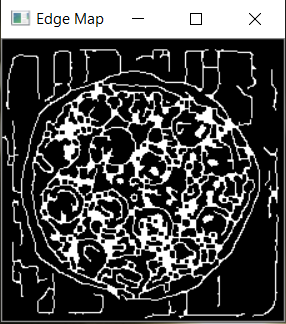
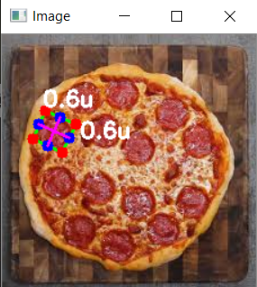
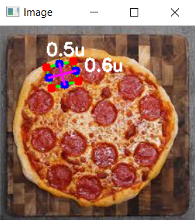
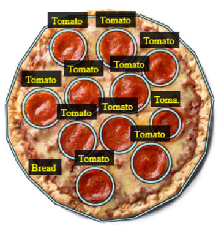

# Food-Analysis
We used instance segmentation to segment pizza toppings and calculate the percentage area covered by the particular topping using Mask-RCNN.

**Train a new model starting from pre-trained COCO weights**
```
 python3 pizza.py train -- dataset=/path/to/dataset — weights=coco
```
**Resume training a model that you had trained earlier**
 ```
 python3 pizza.py train -- dataset=/path/to/dataset — weights=last
 
 ```
**Train a new model starting from ImageNet weights**
```
python3 pizza.py train -- dataset=/path/to/dataset — weights=imagenet
```
pizza.py is present inside : Mask_RCNN/samples/pizza_det

   

   

if you don't want to train the model and just see how model will predict or how the output will look like
just go through the masky.ipynb

if you want to see how the output of model training will look like just go through the training_output image.

for seeing outputs on new images just go through the prediction.ipynb

Note : Do check the paths if it is showing an error + install all the requirements from maskrcnn folder.
